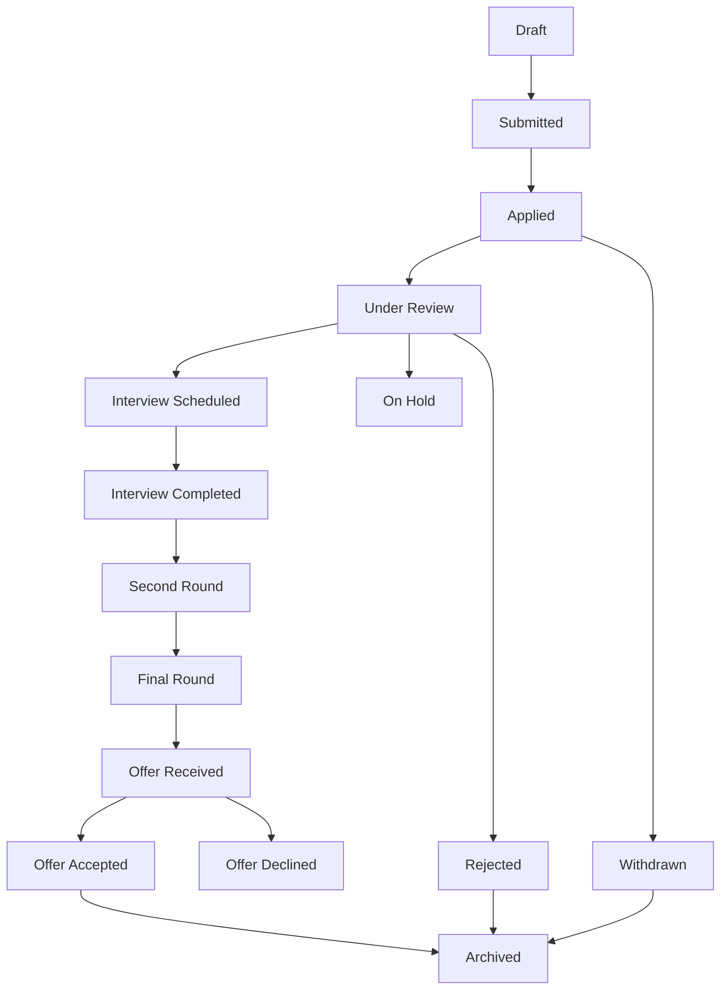

# Vision.AI - Job Application Process Review & Explanation

## 📋 Executive Summary

Vision.AI is an AI-powered job application platform that **automates and streamlines the entire job application lifecycle** - from discovering jobs to tracking application status, scheduling interviews, and managing follow-ups. The platform combines intelligent CV customization, automated form filling, email-based application tracking, and comprehensive analytics.

---

## 🎯 Core Value Proposition

### What Vision.AI Does for Job Seekers

1. **Eliminates Repetitive Work** - No more filling the same information across multiple job boards
2. **AI-Powered Customization** - Automatically tailors CVs and cover letters for each job
3. **Centralized Tracking** - All applications in one dashboard, regardless of where you applied
4. **Email Intelligence** - Monitors your inbox to automatically update application status
5. **Never Miss Follow-ups** - Automated reminders for interviews and follow-up actions

---

## 🔄 Complete Application Process Flow

### Phase 1: Job Discovery & Matching

#### 1.1 Job Aggregation
The platform scrapes jobs from multiple sources:
- **Indeed** - General job listings
- **LinkedIn** - Professional network jobs
- **Glassdoor** - Company reviews + jobs
- **RemoteOK** - Remote-specific positions

**Technical Implementation:**
```
backend/app/workers/job_scraper.py
backend/app/integrations/job_boards/
```

#### 1.2 Intelligent Job Matching
- AI analyzes your CV/profile against job requirements
- Calculates match scores based on:
  - Skills alignment
  - Experience level
  - Location preferences
  - Salary expectations
- Presents best-matched jobs first

**Technical Implementation:**
```
ml-models/models/job_matching.pkl
backend/app/services/job_service.py
```

---

### Phase 2: Application Methods

Vision.AI supports **three distinct application methods**, each optimized for different scenarios:

#### Method 1: Quick Apply (Email-Based) ⚡

**Best For:** Jobs that accept email applications

**User Flow:**
1. User clicks "Quick Apply" button on a job listing
2. System opens pre-filled application form with data from user's CV
3. User reviews/edits information
4. User selects CV and optional cover letter from their documents
5. System sends professional email via user's Gmail account
6. Application automatically tracked in dashboard

**Technical Process:**
```javascript
// Frontend: frontend/assets/js/quick-apply.js
1. openQuickApplyForm(jobId)
   ↓
2. loadPrefillData(jobId) // Fetches user data from CV
   ↓
3. loadUserDocuments() // Lists available CVs/cover letters
   ↓
4. User submits form
   ↓
5. submitApplication() // Sends to backend
```

```python
# Backend: backend/app/api/email_applications.py
1. POST /api/v1/browser-automation/quick-apply/prefill
   - Extracts user data from stored CV
   - Returns pre-filled form data
   
2. POST /api/v1/browser-automation/quick-apply/submit
   - Validates submission
   - Sends email via Gmail API
   - Creates application record
   - Returns confirmation
```

**Data Flow:**
```
User CV → AI Extraction → Form Prefill → User Review → 
Gmail API → Email Sent → Application Created → Dashboard Updated
```

**Key Features:**
- ✅ One-click application
- ✅ Professional email templates
- ✅ Automatic CV attachment
- ✅ Instant tracking
- ✅ No external site navigation

---

#### Method 2: Browser Automation (Auto-Fill) 🤖

**Best For:** Jobs on external sites with application forms

**User Flow:**
1. User clicks "Auto Apply" on job listing
2. Browser automation service opens job application page
3. System intelligently detects and fills form fields
4. User reviews auto-filled data
5. User submits application on external site
6. System tracks application via confirmation email

**Technical Process:**
```javascript
// Browser Automation: browser-automation/
1. Playwright opens application URL
2. ML-based field detection identifies form inputs
3. Maps user data to detected fields
4. Fills form automatically
5. Waits for user confirmation
6. Monitors for confirmation email
```

**Supported Platforms:**
- Indeed (custom handler)
- LinkedIn (custom handler)
- Glassdoor (custom handler)
- Generic job boards (ML-based detection)

**Key Features:**
- ✅ Intelligent form field detection
- ✅ Multi-page form support
- ✅ File upload handling (CV/cover letter)
- ✅ Captcha detection (manual intervention)
- ✅ Error recovery

---

#### Method 3: Manual Application + Email Tracking 📧

**Best For:** Jobs applied manually or on unsupported platforms

**User Flow:**
1. User applies to job manually on external site
2. User clicks "I Applied" button in Vision.AI
3. System scans user's inbox for confirmation email
4. Automatically links confirmation to job record
5. Monitors email thread for employer responses
6. Updates status based on email content

**Technical Process:**
```python
# Email Intelligence: backend/app/services/email_service.py
1. User marks job as "Applied"
2. System searches Gmail for confirmation emails
   - Matches company domain
   - Identifies application confirmations
   - Extracts message_id and thread_id
3. Links email thread to application
4. Periodic scanning for new replies
5. AI analyzes email content
6. Auto-updates application status
```

**Email Analysis:**
- **Confirmation Detection:** "Thank you for applying", "Application received"
- **Interview Invitations:** "Schedule interview", "Would you be available"
- **Rejections:** "Unfortunately", "Not moving forward", "Other candidates"
- **Requests for Info:** "Additional information", "Please provide"

**Key Features:**
- ✅ Universal tracking (any platform)
- ✅ Automatic status updates
- ✅ Email thread preservation
- ✅ Response notifications

---

### Phase 3: Application Tracking & Management

#### 3.1 Application Status Lifecycle

Vision.AI tracks applications through **17 distinct statuses**:



**Status Definitions:**

| Status | Meaning | Typical Duration |
|--------|---------|------------------|
| **Draft** | Application started but not sent | - |
| **Submitted** | Application sent, awaiting confirmation | 1-2 days |
| **Applied** | Confirmation received | 3-7 days |
| **Under Review** | Recruiter reviewing application | 1-2 weeks |
| **Interview Scheduled** | Interview date set | Until interview |
| **Interview Completed** | First interview done | 3-7 days |
| **Second Round** | Advanced to next interview | 1-2 weeks |
| **Final Round** | Final interview stage | 1 week |
| **Offer Received** | Job offer extended | Decision pending |
| **Offer Accepted** | Offer accepted ✅ | - |
| **Offer Declined** | Offer declined | - |
| **Rejected** | Application rejected ❌ | - |
| **Withdrawn** | User withdrew application | - |
| **On Hold** | Process paused | Variable |
| **Archived** | Closed/completed | - |

#### 3.2 Timeline Tracking

Every application maintains a **complete timeline** of events:

```typescript
interface ApplicationTimeline {
  event_type: string;           // "status_change", "interview", "communication"
  status_from: string;           // Previous status
  status_to: string;             // New status
  description: string;           // Human-readable description
  timestamp: datetime;           // When event occurred
  created_by: string;            // "system" or user_id
  is_milestone: boolean;         // Important event flag
  metadata: {
    email_subject?: string;
    interview_type?: string;
    notes?: string;
  }
}
```

**Example Timeline:**
```
📅 Dec 1, 2025 10:30 AM - Application submitted
📧 Dec 1, 2025 10:31 AM - Confirmation email received
👀 Dec 3, 2025 2:15 PM - Status changed to "Under Review"
📞 Dec 5, 2025 9:00 AM - Interview scheduled for Dec 8
✅ Dec 8, 2025 3:30 PM - Interview completed
🎉 Dec 10, 2025 11:00 AM - Offer received
```

#### 3.3 Dashboard Features

**Main Dashboard** (`frontend/pages/applications.html`):

1. **Statistics Overview**
   - Total applications
   - Active applications
   - Interview count
   - Success rate (offers/applications)

2. **Filterable Application List**
   - Filter by status, priority, company
   - Search by job title or company
   - Sort by date, status, priority
   - Pagination support

3. **Tabbed Views**
   - **Applications:** All applications with filters
   - **Upcoming Interviews:** Calendar view of scheduled interviews
   - **Follow-ups Needed:** Applications requiring action
   - **Saved Jobs:** Bookmarked jobs not yet applied to

4. **Application Cards** show:
   - Job title and company
   - Location
   - Current status (color-coded badge)
   - Priority level
   - Application date
   - Application source (email, platform, manual)

**Detailed Application View:**
- Complete timeline of events
- All communications (emails, calls, messages)
- Attached documents (CV, cover letter)
- Interview details and notes
- Follow-up reminders
- Quick actions (update status, schedule interview, set reminder)

---

### Phase 4: Interview Management

#### 4.1 Interview Scheduling

**User Flow:**
1. User receives interview invitation (email or manual entry)
2. User clicks "Schedule Interview" on application
3. Fills interview details:
   - Date and time
   - Interview type (phone, video, in-person, technical, etc.)
   - Location/meeting link
   - Interviewer information
   - Preparation notes

**Interview Types Supported:**
- 📞 **Phone Screening** - Initial recruiter call
- 💻 **Video Call** - Zoom/Teams/Google Meet
- 🏢 **In Person** - On-site interview
- 🔧 **Technical** - Coding/technical assessment
- 💬 **Behavioral** - STAR method questions
- 👥 **Panel** - Multiple interviewers
- 📊 **Presentation** - Present to team
- 📝 **Case Study** - Problem-solving exercise

#### 4.2 Interview Tracking Features

**Upcoming Interviews View:**
- Visual timeline of all scheduled interviews
- Countdown timers ("In 2 hours", "Tomorrow", "In 5 days")
- Urgent indicators for interviews within 24 hours
- Color-coded by interview type
- Quick actions:
  - View application details
  - Add to calendar (iCal export)
  - Update interview notes
  - Mark as completed

**Interview Reminders:**
- Email notifications 24 hours before
- Email notifications 1 hour before
- Dashboard alerts for upcoming interviews

**Post-Interview:**
- Mark interview as completed
- Add interview notes and feedback
- Rate interview experience
- Set follow-up reminder
- Update application status

---

### Phase 5: Communication Tracking

#### 5.1 Email Integration

**Gmail API Integration:**
- OAuth 2.0 authentication
- Read access to monitor application threads
- Send access for quick apply emails
- Secure token storage (encrypted)

**Tracked Communications:**
```typescript
interface Communication {
  type: "email" | "phone" | "sms" | "in_person" | "video_call" | "linkedin";
  direction: "inbound" | "outbound";
  subject: string;
  content: string;
  contact_person: string;
  contact_email: string;
  timestamp: datetime;
  attachments: string[];
  follow_up_required: boolean;
  follow_up_date: datetime;
}
```

#### 5.2 Automatic Status Updates

**Email Analysis Pipeline:**
```
New Email Received
    ↓
Extract sender, subject, content
    ↓
Match to application thread
    ↓
AI/Keyword analysis
    ↓
Determine intent (interview, rejection, request)
    ↓
Update application status
    ↓
Create timeline event
    ↓
Notify user
```

**Detection Keywords:**

| Intent | Keywords | Action |
|--------|----------|--------|
| **Interview** | "schedule", "interview", "available", "meet" | Status → Interview Scheduled |
| **Rejection** | "unfortunately", "not moving forward", "other candidates" | Status → Rejected |
| **Offer** | "offer", "congratulations", "pleased to offer" | Status → Offer Received |
| **Request** | "additional information", "please provide", "clarification" | Add task, set reminder |
| **Confirmation** | "received your application", "thank you for applying" | Status → Applied |

---

### Phase 6: Document Management

#### 6.1 CV/Resume Management

**Supported Formats:**
- PDF (`.pdf`)
- Microsoft Word (`.docx`)
- Plain Text (`.txt`)

**CV Processing Pipeline:**
```
Upload CV
    ↓
Extract text (PyPDF2/python-docx)
    ↓
AI parsing (OpenAI GPT)
    ↓
Extract structured data:
    - Personal info (name, email, phone)
    - Work experience
    - Education
    - Skills
    - Certifications
    ↓
Store in database
    ↓
Available for quick apply prefill
```

**CV Customization:**
- AI generates job-specific CVs
- Highlights relevant skills
- Emphasizes matching experience
- Adjusts keywords for ATS optimization
- Version control (track customizations)

#### 6.2 Cover Letter Generation

**AI-Powered Generation:**
```python
# Input
- Job description
- Company information
- User's CV/experience
- Desired tone (professional, enthusiastic, formal)

# AI Prompt
"Generate a compelling cover letter for {job_title} at {company}
based on the candidate's experience: {experience_summary}.
Highlight: {relevant_skills}. Tone: {tone}."

# Output
- Customized cover letter
- Proper formatting
- Company-specific details
- Relevant achievements highlighted
```

**Cover Letter Templates:**
- Professional (standard)
- Enthusiastic (startup/creative)
- Formal (corporate/government)
- Technical (engineering roles)
- Academic (research positions)

---

## 🔧 Technical Architecture

### Backend Stack

**Framework:** FastAPI (Python)
- High performance async API
- Automatic OpenAPI documentation
- Type validation with Pydantic
- JWT authentication

**Database:** MongoDB
- Flexible document structure
- Fast queries with indexing
- Aggregation pipeline for analytics
- GridFS for file storage

**Key Collections:**
```
users          - User accounts and profiles
jobs           - Job listings from all sources
applications   - Application records and tracking
documents      - CVs, cover letters, certificates
notifications  - User notifications
email_logs     - Email tracking history
```

**Background Jobs:** Celery + Redis
- Job scraping (scheduled)
- Email monitoring (periodic)
- Status updates (event-driven)
- Notification sending (queued)

**AI/ML Services:**
- OpenAI GPT-4 for text generation
- Custom ML model for job matching
- NLP for email analysis
- CV parsing and extraction

### Frontend Stack

**Core:** Vanilla JavaScript (ES6+)
- No framework overhead
- Fast page loads
- Progressive enhancement
- Modular architecture

**Styling:** Tailwind CSS
- Utility-first approach
- Responsive design
- Custom color scheme
- Dark mode support (planned)

**Key Pages:**
```
/pages/jobs.html           - Job search and listings
/pages/applications.html   - Application dashboard
/pages/profile.html        - User profile and settings
/pages/documents.html      - CV/document management
/pages/analytics.html      - Application analytics
```

### Browser Automation Service

**Runtime:** Node.js + Express
**Automation:** Playwright
- Cross-browser support (Chrome, Firefox, Safari)
- Headless mode for efficiency
- Screenshot capture for debugging
- Network interception for tracking

**ML Field Detection:**
- Trains on common form patterns
- Identifies field types (name, email, phone, etc.)
- Handles dynamic forms (React, Vue, Angular)
- Adapts to site-specific layouts

---

## 📊 Analytics & Insights

### User Dashboard Metrics

**Application Funnel:**
```
Jobs Viewed → Jobs Saved → Applications Sent → 
Interviews → Offers → Accepted
```

**Success Metrics:**
- Application-to-interview ratio
- Interview-to-offer ratio
- Average response time
- Most successful job boards
- Best performing job types

**Time Analysis:**
- Average time to first response
- Average time to interview
- Average time to offer
- Application velocity (apps per week)

**Company Insights:**
- Response rate by company
- Interview difficulty ratings
- Offer competitiveness
- Application success patterns

---

## 🔐 Security & Privacy

### Data Protection

**Authentication:**
- JWT tokens with expiration
- Bcrypt password hashing
- Refresh token rotation
- Session management

**Email Security:**
- OAuth 2.0 (no password storage)
- Encrypted token storage
- Scoped permissions (read/send only)
- Revocable access

**Data Encryption:**
- HTTPS for all communications
- Encrypted database fields (sensitive data)
- Secure file storage
- Regular security audits

**Privacy Controls:**
- User data ownership
- Export functionality
- Account deletion
- GDPR compliance

---

## 🚀 Advanced Features

### 1. Email Agent (Planned)

**Concept:** Autonomous email monitoring and response
- Scans inbox for job-related emails
- Auto-categorizes communications
- Suggests responses
- Tracks all interactions
- Links emails to applications automatically

### 2. AI Interview Prep

**Features:**
- Common interview questions for role
- STAR method answer templates
- Company research summaries
- Salary negotiation tips
- Mock interview practice (future)

### 3. Salary Intelligence

**Data Points:**
- Market rate for position
- Company salary ranges
- Location adjustments
- Experience-based estimates
- Negotiation recommendations

### 4. Application Templates

**Pre-configured Strategies:**
- "Spray and Pray" - High volume, quick apply
- "Targeted" - Fewer, highly customized applications
- "Passive" - Only dream jobs
- "Aggressive" - Daily application goals

---

## 📈 User Journey Examples

### Example 1: Software Engineer Job Search

**Day 1:**
1. User uploads CV (software_engineer_cv.pdf)
2. System extracts: Python, React, AWS, 5 years experience
3. User sets preferences: Remote, $100k-150k, Full-time
4. System finds 47 matching jobs

**Day 2:**
1. User reviews top 10 matches
2. Quick applies to 3 jobs with email contact
3. Auto-applies to 2 jobs on Indeed
4. Saves 5 jobs for later review
5. Dashboard shows: 5 applications, 0 responses

**Day 5:**
1. System detects confirmation email from Company A
2. Status updated: Applied → Under Review
3. User receives notification
4. User adds notes about Company A

**Day 8:**
1. Email from Company B: Interview invitation
2. System auto-updates status: Interview Scheduled
3. User clicks notification, schedules interview
4. Interview added to calendar
5. Reminder set for 24 hours before

**Day 12:**
1. User completes interview with Company B
2. Marks interview as completed
3. Adds interview notes and feedback
4. Sets follow-up reminder for 3 days

**Day 15:**
1. Offer email from Company B detected
2. Status updated: Offer Received
3. User reviews offer details
4. User accepts offer
5. Status updated: Offer Accepted
6. Other applications marked as Withdrawn

**Final Stats:**
- 5 applications sent
- 2 interviews
- 1 offer
- 20% success rate
- 15 days from first application to offer

### Example 2: Marketing Manager Career Change

**Week 1:**
1. User uploads old CV (marketing_specialist.pdf)
2. Realizes CV needs updating for manager roles
3. Uses AI to generate manager-level CV
4. Emphasizes leadership and strategy experience
5. Saves both versions

**Week 2:**
1. Searches for "Marketing Manager" roles
2. Filters: $80k+, Hybrid/Remote, Tech industry
3. Finds 23 matching positions
4. Quick applies to 5 with customized cover letters
5. AI generates unique cover letter for each

**Week 3:**
1. 3 confirmation emails received
2. 1 rejection (not enough management experience)
3. 1 interview invitation from startup
4. User schedules video call interview

**Week 4:**
1. Interview completed, went well
2. Second round scheduled (panel interview)
3. User adds preparation notes
4. Researches company and interviewers

**Week 5:**
1. Second interview completed
2. Offer received: $85k + equity
3. User negotiates to $90k
4. Offer accepted
5. Journey complete: 5 weeks, 5 applications, 1 offer

---

## 🎓 Best Practices & Tips

### Maximizing Success Rate

**1. CV Optimization:**
- Keep CV updated and accurate
- Use keywords from job descriptions
- Quantify achievements (numbers, percentages)
- Tailor for each industry
- Keep formatting ATS-friendly

**2. Application Strategy:**
- Apply within 24 hours of job posting
- Customize cover letters for top choices
- Follow up after 1 week of no response
- Track all applications (even manual ones)
- Set realistic daily/weekly goals

**3. Interview Preparation:**
- Research company thoroughly
- Prepare STAR method examples
- Practice common questions
- Prepare questions to ask
- Test tech setup for video interviews

**4. Follow-up Timing:**
- Thank you email within 24 hours
- Status check after 1 week
- Second follow-up after 2 weeks
- Know when to move on (3+ weeks silence)

### Common Pitfalls to Avoid

❌ **Don't:**
- Apply to jobs you're not qualified for
- Use generic cover letters
- Forget to proofread applications
- Miss interview preparation
- Ignore follow-up reminders
- Apply to too many jobs at once (burnout)

✅ **Do:**
- Focus on quality over quantity
- Customize each application
- Track every application
- Prepare for each interview
- Follow up professionally
- Maintain organized records

---

## 🔮 Future Roadmap

### Planned Features

**Q1 2026:**
- [ ] LinkedIn integration (auto-apply)
- [ ] Mobile app (iOS/Android)
- [ ] Advanced analytics dashboard
- [ ] Salary negotiation assistant
- [ ] Interview recording and analysis

**Q2 2026:**
- [ ] AI mock interviews
- [ ] Resume builder with templates
- [ ] Job alert notifications (push)
- [ ] Chrome extension for quick apply
- [ ] Integration with Calendly/Google Calendar

**Q3 2026:**
- [ ] Company review aggregation
- [ ] Referral network matching
- [ ] Skills gap analysis
- [ ] Learning path recommendations
- [ ] Career progression tracking

**Q4 2026:**
- [ ] AI career coach chatbot
- [ ] Video interview practice
- [ ] Portfolio builder
- [ ] Networking event finder
- [ ] Mentorship matching

---

## 📞 Support & Resources

### Documentation
- API Documentation: `/docs` (Swagger UI)
- User Guide: `/docs/user-guide.md`
- Developer Guide: `/docs/developer-guide.md`
- Architecture: `/docs/architecture.md`

### Getting Help
- Email: support@visionai.com
- Discord: discord.gg/visionai
- GitHub Issues: github.com/visionai/issues
- FAQ: visionai.com/faq

---

## 🎉 Conclusion

Vision.AI transforms the job application process from a tedious, manual chore into an **intelligent, automated, and trackable workflow**. By combining:

- 🤖 **AI-powered automation** (CV parsing, form filling, email analysis)
- 📧 **Email intelligence** (automatic tracking and status updates)
- 📊 **Comprehensive analytics** (success metrics and insights)
- 🎯 **Smart matching** (find the best-fit jobs)
- ⏰ **Never miss anything** (reminders and notifications)

...job seekers can focus on what matters: **preparing for interviews and landing their dream job**, while Vision.AI handles the rest.

---

**Last Updated:** December 6, 2025  
**Version:** 1.0  
**Author:** Vision.AI Team
