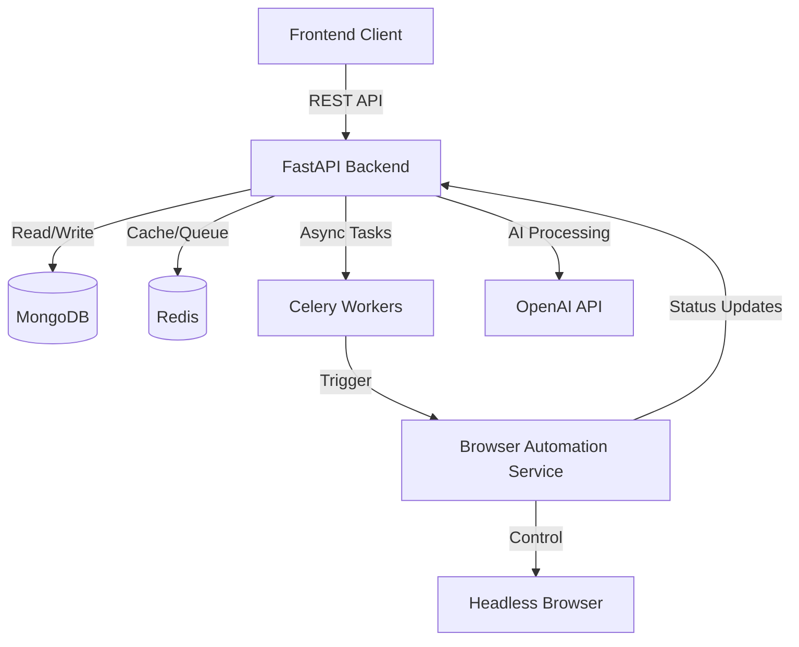

# Vision.AI Project Walkthrough

## 1. Project Overview
Vision.AI is an AI-powered job application platform that automates the job search process. It leverages OpenAI for intelligent document processing and Puppeteer for browser automation to streamline applications.

## 2. Architecture
The project follows a microservices-like architecture with a clear separation of concerns:

### 2.1 Backend (FastAPI)
*   **Location**: `backend/app`
*   **Core Framework**: FastAPI
*   **Database**: MongoDB (using Motor for async access)
*   **Authentication**: JWT-based with `AuthService`
*   **Key Services**:
    *   `AuthService`: User management, password hashing (bcrypt), token generation.
    *   `AIService`: Wraps OpenAI calls for CV parsing, customization, and cover letter generation.
    *   `DocumentService`: Handles file uploads, storage, and retrieval.
*   **Configuration**: `config.py` manages environment variables and settings.

### 2.2 Frontend (Vanilla JS)
*   **Location**: `frontend/`
*   **Tech Stack**: Vanilla JavaScript, Tailwind CSS.
*   **Core Modules**:
    *   `main.js`: Global `CONFIG`, `API` client wrapper, and `Utils`.
    *   `auth.js`: Handles login, registration, and social auth flows.
    *   `dashboard.js`: Manages the main user dashboard, file uploads, and data display.
*   **State Management**: `localStorage` is used for persisting auth tokens and user info.

### 2.3 Browser Automation (Node.js)
*   **Location**: `browser-automation/`
*   **Tech Stack**: Node.js, Express, Puppeteer.
*   **Functionality**:
    *   Exposes an API (`/api/automation/start`) to initiate automation sessions.
    *   `AutofillEngine`: Fills forms on target websites.
    *   `FormDetector`: Identifies form fields using heuristics.
    *   `SiteHandlerFactory`: Selects specific logic for different job boards.

## 3. Key Workflows

### 3.1 User Authentication
1.  User submits credentials via `login.html`.
2.  `auth.js` calls `CVision.API.login`.
3.  Backend `AuthService` verifies credentials and issues JWT.
4.  Frontend stores token in `localStorage` and redirects to `dashboard.html`.

### 3.2 Document Upload & Parsing
1.  User drops file in `dashboard.html`.
2.  `FileUpload` class in `main.js` handles the event.
3.  File is sent to `/api/v1/documents/upload`.
4.  Backend saves file and triggers `AIService.process_cv_with_ai`.
5.  OpenAI parses the CV text into structured JSON.
6.  Parsed data is stored in MongoDB and returned to frontend.

### 3.3 Job Application Automation
1.  User triggers application from frontend.
2.  Backend validates request and queues task via Celery.
3.  Celery worker calls Browser Automation Service.
4.  Automation service launches Puppeteer, navigates to job URL, and autofills form.
5.  Status updates are sent back to the backend.

## 4. Data Models
*   **User**: Comprehensive profile including `SubscriptionTier`, `UsageStats`, and `UserProfile` (skills, experience).
*   **Document**: Stores file metadata and parsed `cv_data`.
*   **Job**: (Implied) Stores job details and match scores.

## 5. Deployment
*   **Docker**: `docker-compose.yml` orchestrates Backend, Mongo, Redis, Celery, Automation Service, and Nginx.
*   **Nginx**: Serves static frontend files and proxies API requests.
